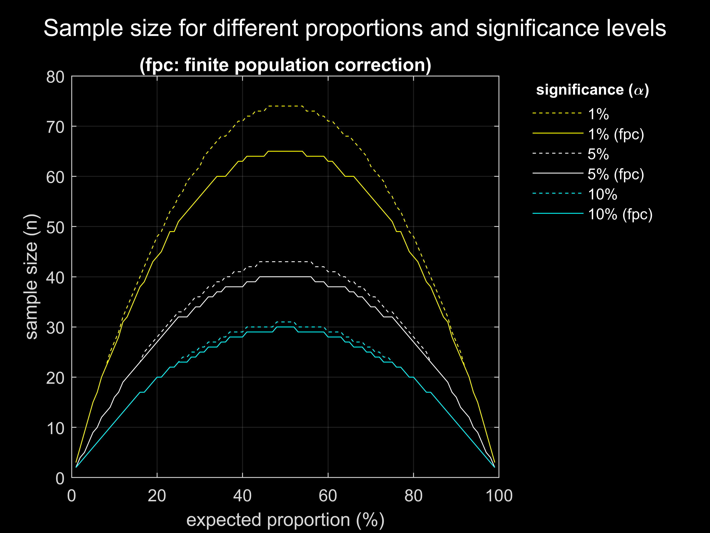

# Sample size calculators
Sample size calculators for a proportion and for a cluster randomised
controlled trial with a fixed number of clusters. See:

[Hemming, K., Girling, A. J., Sitch, A. J., Marsh, J., & Lilford, R. J. (2011). Sample size calculations for cluster randomised controlled trials with a fixed number of clusters. BMC medical research methodology, 11(1), 1-11.](https://bmcmedresmethodol.biomedcentral.com/articles/10.1186/1471-2288-11-102/ "Hemming, K., Girling, A. J., Sitch, A. J., Marsh, J., & Lilford, R. J. (2011). Sample size calculations for cluster randomised controlled trials with a fixed number of clusters. BMC medical research methodology, 11(1), 1-11.")

